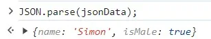

:source-highlighter: highlight.js
:highlightjs-theme: atom-one-dark-reasonable
[,javascript]

== Object literal (物件實字)

用大括號來建立物件的語法
屬性用名值對(name-value pairs)表示

[source, javascript]

----
const person = {
    firstName: "John",
    lastName: "Doe",
    age: 30,
    isEmployed: true
};

----

=== ES6後，物件的擴展（object literal extension）
==== 物件屬性簡寫
變數名稱和屬性名稱一樣
物件的屬性名稱為變數的名稱，物件的屬性值為變數的值

[source, javascript]
----
let text = '我是誰';
let msg2 = { // 縮寫前
  text: text
};
let msg2 = { text }; // 縮寫後 
----
==== 物件函式的語法簡寫
省略了冒號 : 和 function 關鍵字
這樣簡寫的方法，預設的屬性名稱會是字串的型態，本的簡寫 fn( ){...} 等同於 'fn'( ){...}

[source, javascript]
----
// ES5
let obj1 = {
  fn: function() {
    return 'ES5';
  }
};
console.log(obj1.fn());//ES5
----

[source,javascript]
----
// ES6
let obj3 = {
  fn() {
    return 'ES6';
  }
};
console.log(obj3.fn());//ES6
----
==== 具運算性的屬性名稱
使用中括號[ ] 將表達式作為屬性名稱

[source, javascript]
----
let obj = {
  ["na"+"me"]: 'kent'
}
console.log(obj.name); // kent
----

#撰寫程式碼的時候, 以團隊 code styling 為主, 儘量不寫縮寫過後的程式碼#

== Optional Chaining

可選串連運算子
在「要確認的屬性或函式」後方「加上或換上」「?.」
避開TypeError Exception
判斷當前（?. 左側）這個屬性或函式是否為 Nullish 值：也就 undefined 或 null，有的話會往右繼續執行，否則就停止執行，並回傳undefined

[source, javascript]

----
const releasedYear = phone?.year;
//先確認 phone 屬性再取得 year 屬性值回傳
----
==== Nullish coalescing operator

空值合併運算子
在「要確認的屬性或函式」後方「加上或換上」「??」
當左側的操作數為null或者undefined時，返回其右側操作數，否則返回左側操作數

[source,javascript]

----
const foo=null ?? 'default string';
console.log(foo);//"default string"

const baz=0 ?? 42;
console.log(baz);//0
----

== JavaScript Object vs JSON

JSON( JavaScript Object Notation )就是一組字串
JavaScript Object在使用{ }建立物件時，屬性名稱是可以有引號也可以沒有的，但在JSON格式中，屬性名稱一定要有雙引號
物件中的值為function，是無法透過JSON傳遞的

將物件轉成JSON格式 JSON.stringify();

將JSON格式轉成物件 JSON.parse()

== HTTP
.主要特點：
* 無狀態(stateless)：每個請求與其之前或之後的請求無關
* 可擴展(scalable)：通過標頭和方法可以擴展功能
* 安全性：HTTPS（HTTP Secure）提供了加密和身份驗證

==== stateless vs. stateful

[width=85%, cols="2,4,3"]
[options="header"]
[%autowidth]
|===
| |stateless |Stateful
|定義 |每次用戶端發請求，伺服器都視為全新的請求

=>依靠用戶端給予的資訊

|追蹤session或是transactions ，並根據該歷史記錄對相同的輸入做出不同的反應 

=>根據的先前的紀錄而改變執行結果

|優點
|減少資源消耗，特別是在處理大量短期請求時更具效率和可擴展性|記住用戶端的操作，提供個性化的用戶體驗
|缺點
|無法提供個人化體驗，需額外的機制（如 cookies 或 token）來保存和傳遞狀態信息。|耗費較多資源追蹤seeeion和transactions
|例子|HTTP | session
|===

** HTTP status Code不屬於狀態，是請求完成後的結果

== HTTP Headers/Payload

發請求和接收回應的重要組成部分

用一個信封比喻

* HTTP Headers=> 地址、寄件人、收件人...

* Payload => 信件內容

---

=== HTTP Header包含的內容
1.Authentication 驗證
驗證用戶端身分，以保護伺服器端安全

 WWW-Authenticate: Basic realm="Example"

2.Caching 快取
藉由重複使用先前取過的資源，減少網路傳輸量

request中使用的cache

 Cache-Control: no-store //不儲存任何快取資料

response中使用的cache

 Cache-Control: max-age=<秒數> //快取資料的有效時間
  
 
3.Conditionals 條件式
客戶端在特定條件下請求資源，節省頻寬
 
 If-Modified-Since: Wed, 21 Oct 2020 07:28:00 GMT //自2020/10/21開始資源未被修改則抓取本地站存的資源
 
4.Connection management 連線管理
客戶端與伺服器端的連線狀態
 
 Connection: keep-alive //與伺服器保持連線

5.Content negotiation
資源的表示方式

 Accept-Language: en-US //英文

6.Cookies
紀錄用戶訊息
  
  Cookie: VISITOR_INFO1_LIVE=-obHrhCAQzA; VISITOR_PRIVACY_METADATA=CgJUVxIEGgAgLQ%3D%3D; YSC=Wf57uX-mbBc

7.CORS

  HTTPS的安全機制，可以跨到不同網站取資源
 
=== HTTP Headers：

客戶端和服務器之間互動所附加的的訊息(如瀏覽器類型、 傳遞的資料類型etc..)

自定義的header訊息用『x-』開頭，大多數已經廢除。

* 例子: 

 x-content-type-options:　nosniff 
 
 //規定只能遵照context-type的格式解析資源，提高網頁安全性，避免MIME類型混淆
 

補充：

MIME：標示網路上各種文件類型的標準，如：

 * text/html：HTML 文件
 * text/plain：純文本文件
 * image/jpeg：JPEG 圖像
 * image/png：PNG 圖像
 * application/json：JSON 文件

MIME類型混淆:伺服器識別資源類型時，解析錯誤。

如將javascript標記為text/plain，誘導伺服器去解析其內容

=== HTTP Headr分類：

==== 1.Request Headers

客戶端發出請求時夾帶的訊息，如要訪問的伺服器名稱、可接受的編碼格式等

常見的Request headers訊息：

  * Host: 訪問的伺服器主機名稱
  
  Host: www.w3schools.com
 
  * User-Agent：客戶端應用程序的資訊
    
   User-Agent：PostmanRuntime/7.40.0

  * Accept-Encoding： 客戶端編碼格式

  　Accept-Encoding: gzip, deflate, br

  *  Request methods:HTTP 請求方式

  　Request methods:HTTP: GET /index.html

==== 2.Response Headers

伺服器回應的訊息。
  
常見的Response headers訊息：
  
  * Server: 伺服器端的server類型
  
   Server :ECS (hhp/9ABD)
  
  * Date: 回傳日期

   Date: Wed, 31 Jul 2024 02:12:13 GMT

  * Status Code: 回傳執行結果
   
   Status Code:200 OK

==== 3.Representation header

表示回傳內容的格式，放在response Header裡面

* Content-Type: 回傳資源的格式
 
 Content-Type: text/html

* Content-Encoding: 編碼

 Content-Encoding: gzip

* Content-Language： 語言

 Content-Language： en

==== Payload：

request和respon包含的數據內容。

Request Payload (Request body) : 客戶端傳送Request請求所攜帶的資源參數。

Response Payload (Response  body) : 伺服器端回傳Response所攜帶的資源參數。

==== Payload vs. form

[width=85%, cols="2,4,3"]
[options="header"]
[%autowidth]
|===
| |Payload |form
|資料格式 |支援多種格式 如: json、xml、URL編碼格式... |URL編碼格式、
多部分編碼格式
|Context-type 
| application/json .1+| application/x-www-form-urlencoded

 multipart/form-data

|資料格式|{
  "name": "John Doe",
  "age": 30
}| name=John+Doe&age=30
|===

  參考資料：https://blog.csdn.net/qq_43842093/article/details/125883101

== Request Method

.GET
* 查詢
* 會回傳結果，帶參數的查詢會加在URL上面

帶參數GET方法URL

 https://book.tpml.edu.tw/search?searchInput=javascript&searchField=FullText

.HEAD
* 查詢對象的header
* 不會回傳資料

.POST
* 增、改
* 較常用在新增資料
* 修改的項目會包在body裡面

.PUT
* 增、改	
* 常用在修改資料
* 整筆覆蓋
* 若修改對象不存在 => 新增一筆新的
* 修改的項目會包在body裡面

.PATCH
* 更新資料
* 只修改異動的部分部分

.DELETE
* 刪除資料

.CONNECT
* 建立連線
EX.代理伺服器連線

.OPTIONS
* 查詢對方可用支援那些HTTP 方法

.TRACE		
* 偵測HTTP請求其間是否有變化，中間路由若有錯誤可用此方法
* HTML表單內不適用

==== hTTP method 比較

 * SAFE：不會對伺服器進行任何修改

 * IDEMPOTENT：重新導向(重複發送相同的請求)結果完全相同

 * CACHEABLE:允許快取

此為規範，實務上並非完全遵照，有部分內容僅在特定條件下才成立

EX: GET請求的若重新發送的同時，伺服器上的資源有被更動過，則回傳的結果不一致

[width=75%, cols="1,1,1,1,2,6"]
[options="header"]
|===
|Verb |SAFE |IDEMPOTENT|Cacheable|動作|語意
|GET	|O	|O	|O	|讀取	|請求所需要的資源。
|HEAD	|O	|O	|O	|讀取	|與GET相同，但只傳Header不傳資料。
|POST	|X	|X	|O	|新增	|在請求中攜帶負載(payload)，並執行新增/修改。
|PUT	|X	|O	|X	|完整更新	|請求更新一筆資源的所有內容，必須是存在的資源，資源傳遞必須完整，否則為空。
|PATCH	|X	|X	|X	|部分更新	|請求更新一筆資源的部分內容，必須是存在的資源。
|DELETE	|X	|O	|x	|刪除	|請求移除資源。
|CONNECT	|X	|X	|x	|建立通訊	|向server端建立連線
|OPTIONS	|O	|O	|x	|查詢通訊方式	|告訴server允許的通訊方式
|TRACE	|O	|O	|x	|偵測	|偵測HTTP通訊請求方式。

|===
  參考資料：
  https://hackmd.io/@monkenWu/Sk9Q5VoV4/https%3A%2F%2Fhackmd.io%2F%40gen6UjQISdy0QDN62cYPYQ%2FH1yxwXyNN?type=book

==== HTTP Statue Code

回傳HTTP請求是否已成功

1.資訊性回覆( 100– 199)

2.成功回覆( 200– 299)

3.重定向訊息( 300– 399)

4.客戶端錯誤回應( 400– 499)

5.伺服器錯誤回應( 500– 599)
					
==== 200 OK
請求成功。 

==== 300

==== 301
暫時的重導向

==== 302 永久的重導向

==== 304 Not Modified
用戶重新導向頁面時不需重新發request

==== 400 bad request

==== 401 Unauthorized
伺服器無法驗證用戶端身分的時候回傳，並夾帶 "WWW-Authenticate"的，告訴用戶端必須提供身分驗證的訊息。

==== 404 Not Found
伺服器找不到所請求的資源。在瀏覽器中，這表示該 URL 無法識別。

==== 405 Method Not Allowed
伺服器已知請求方法，但目標資源不支援。例如不允許呼叫DELETE刪除資源。

==== 500 Internal Server Error

==== 503 Service Unavailable
伺服器尚未準備好處理請求。

常見原因是伺服器因維護而停機或過載。

==== 504 Gateway Timeout
當伺服器，無法及時得到回應時，會出現此錯誤回應。

=== 什麼是跨域資源共享(Cross-Origin Resource Sharing) ?

Server 可以去和瀏覽器說, 允許除了自身以外, 及自身允許的來源網站所發送過來的 Request, 可以被正常的回傳 response。

瀏覽器的同源政策(Same-Origin-Policy), 是一種瀏覽器的安全機制, 用來防止網站被其他來入不明的網站所存取。

同源必須符合三項條件:

. 同通訊埠(port)

. 同通訊協定(protocol)

. 同網域(domain)

那假如現在後端設定的 Response Headers 中 Access-Control-Allow-Origin 為: https://api.example.com

[cols="2,1,2", options="header"]
|===
|URL |是否同源 |原因
|http://api.example.com/
|N
|不同 protocol

|https://app.example.com/
|N
|不同 domain

|http://api.example.com:5000/
|N
|不同 port

|http://api.example.com/login
|Y
|
|===

==== CORS 的兩大流程: 

==== 一、簡單請求 (Simple Requests)

成為 Simple Request 必須具備什麼條件 ?

使用以下任一 HTTP Method：

[cols="1,2", options="header"]
|===
|Method |說明
|GET
|獲取資料

|POST
|提交資料

|HEAD
|只返回 HTTP Headers

|===

----
HTTP/1.1 200 OK
Date: Tue, 30 Jul 2024 12:34:56 GMT
Content-Type: text/html
Content-Length: 1234
Last-Modified: Tue, 30 Jul 2024 10:00:00 GMT
----

&

Content-Type 的值為以下任一：

ex: Content-Type 為 Http Headers 其中一個屬性, 用來描述請求和回應中的 Media Type

[cols="1,3", options="header"]
|===
|Content-Type |備註

|application/x-www-form-urlencoded
|預設表單提交

|multipart/form-data
|在表單內上傳檔案、圖片、影片

|text/plain
|純文本
|===

符合以上即為一個 Simple Request;

接下來打開 F12 來看看瀏覽器發送給 Server 的內容有哪些：

===== Request Headers
----
GET / HTTP/1.1
Host: api.example.com
Connection: keep-alive
Accept: text/html,application/xhtml+xml,application/xml;q=0.9,image/webp,/;q=0.8
User-Agent: Mozilla/5.0 (Windows NT 10.0; Win64; x64) AppleWebKit/537.36 (KHTML, like Gecko) Chrome/103.0.0.0 Safari/537.36
Accept-Encoding: gzip, deflate, br
Accept-Language: zh-TW,en;q=0.9
Origin: http://example.com/   // 比較值得注意的 Origin(來源目標網站)
----

===== Response Headers
----
HTTP/1.1 200 OK
Content-Type: text/html; charset=UTF-8
Content-Length: 1234
Access-Control-Allow-Origin: *  // 後端設為所有網站都可存取
----
==== 二、預檢請求(Preflighted requests)

如沒有滿足剛剛介紹的條件, 即為預檢請求，我就直接稱作 非簡單請求。
像是常使用的HTTP Method PUT、DELETE、或在 HTTP Header 設定的 Content-Type: application/json , 這些都是非簡單請求。

===== 運作方式

image::pr.png[Alt Text]

與簡單請求不同的地方是, 瀏覽器會先送一次 HTTP Request, 確定請求是否安全, 因為請求可是會對資料產生變動的所以瀏覽器就發送一個 OPTIONS Method 去問後端是否允許這次的跨域請求(ex: 同源政策不擋請求只擋回應 !), 允許的話才會真正對 Server 發送真實的數據請求。

但預檢請求也不是每次都會觸發，可以設定 Access-Control-Max-Age 預檢請求回應快取的秒數，也就是說在這秒數內可以向 Simple Request 一樣, 直接發送請求。

== 什麼是跨站請求偽造(Cross Site Reuqest Forgery)？
在使用者已經驗證身份的網站中, 執行惡意的偽造操作。

Step1: 使用者成功登入 A 銀行網站的帳戶，並且代表使用者身份的 cookie 在 local 保存下來，所以下次再來訪問 A 銀行網站時，就不用重新登入。

Step2: 因為使用者沒有登出 A 銀行網站的帳戶，在瀏覽 B 惡意網站時，B 網站有個被設為透明的圖片，因為是透明的，所以使用者在畫面上看不到，然而該圖片包含一段惡意程式碼，連結如下。

----

----

Step3: 雖然使用者看不到此圖片， 但是，瀏覽器仍會向 http://a-bank.com/ 提交請求，同時此請求是帶有使用者的 cookie，所以 A 銀行可以辨識使用者身份，這個惡意攻擊會執行成功。

參考資料:

https://developer.mozilla.org/zh-TW/docs/Web/HTTP/CORS