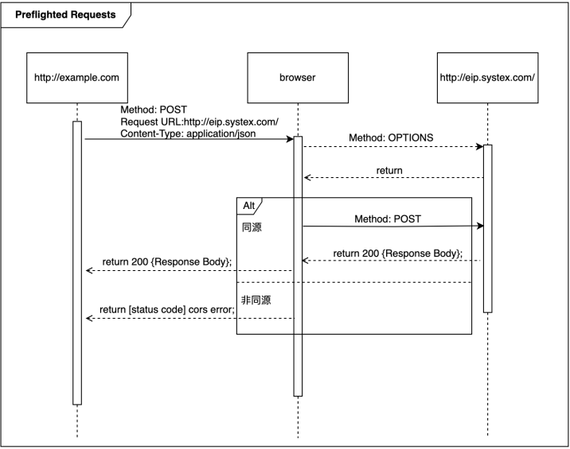

:source-highlighter: highlight.js
:highlightjs-theme: atom-one-dark-reasonable
[,javascript]

=== 什麼是跨域資源共享(Cross-Origin Resource Sharing) ?

Server 可以去和瀏覽器說, 允許除了自身以外, 及自身允許的來源網站所發送過來的 Request, 可以被正常的回傳 response。

瀏覽器的同源政策(Same-Origin-Policy), 是一種瀏覽器的安全機制, 用來防止網站被其他來入不明的網站所存取。

同源必須符合三項條件:

. 同通訊協定(protocol)

. 同網域(domain)

. 同通訊埠(port)

那假如現在後端設定的 Response Headers 中 `Access-Control-Allow-Origin` 為: `https://api.example.com`

[cols="2,1,2", options="header"]
|===
|URL |是否同源 |原因
|http://api.example.com
|N
|不同 protocol

|https://app.example.com
|N
|不同 sub domain

|http://api.example.com:5000
|N
|不同 port

|https://api.example.com/login
|Y
|
|===

==== CORS 的兩大流程: 

==== 一、簡單請求 (Simple Requests)

成為 Simple Request 必須具備什麼條件 ?

使用以下任一 HTTP Method：

[cols="1,2", options="header"]
|===
|Method |說明
|GET
|獲取資料

|POST
|提交資料

|HEAD
|只返回 HTTP Headers

|===

----
HTTP/1.1 200 OK
Date: Tue, 30 Jul 2024 12:34:56 GMT
Content-Type: text/html
Content-Length: 1234
Last-Modified: Tue, 30 Jul 2024 10:00:00 GMT
----

*&*

Content-Type 的值為以下任一：

ex: Content-Type 為 Http Headers 其中一個屬性, 用來描述請求和回應中的 Media Type

[cols="1,3", options="header"]
|===
|Content-Type |備註

|application/x-www-form-urlencoded
|預設表單提交

|multipart/form-data
|在表單內上傳檔案、圖片、影片

|text/plain
|純文本
|===

符合以上即為一個 Simple Request;

接下來打開 F12 來看看瀏覽器發送給 Server 的內容有哪些：

===== *Request Headers*
----
GET / HTTP/1.1
Host: api.example.com
Connection: keep-alive
Accept: text/html,application/xhtml+xml,application/xml;q=0.9,image/webp,*/*;q=0.8
User-Agent: Mozilla/5.0 (Windows NT 10.0; Win64; x64) AppleWebKit/537.36 (KHTML, like Gecko) Chrome/103.0.0.0 Safari/537.36
Accept-Encoding: gzip, deflate, br
Accept-Language: zh-TW,en;q=0.9
Origin: http://example.com   // 比較值得注意的 Origin(來源目標網站)
----

===== *Response Headers*
----
HTTP/1.1 200 OK
Content-Type: text/html; charset=UTF-8
Content-Length: 1234
Access-Control-Allow-Origin: *  // 後端設為所有網站都可存取
----

==== 二、預檢請求(Preflighted requests)

如沒有滿足剛剛介紹的條件, 即為預檢請求，我就直接稱作 `非簡單請求`。
像是常使用的HTTP Method `PUT`、`DELETE`、或在 HTTP Header 設定的 `Content-Type: application/json` , 這些都是非簡單請求。

===== 運作方式

與簡單請求不同的地方是, 瀏覽器會先送一次 HTTP Request, 確定請求是否安全, 因為請求可是會對資料產生變動的所以瀏覽器就發送一個 OPTIONS Method 去問後端是否允許這次的跨域請求(ex: 同源政策不擋請求只擋回應 !), 允許的話才會真正對 Server 發送真實的數據請求。

但預檢請求也不是每次都會觸發，可以設定 `Access-Control-Max-Age` 預檢請求回應快取的秒數，也就是說在這秒數內可以向 Simple Request 一樣, 直接發送請求。

== 什麼是跨站請求偽造(Cross Site Reuqest Forgery)？
在使用者已經驗證身份的網站中, 執行惡意的偽造操作。

Step1: 使用者成功登入 A 銀行網站的帳戶，並且代表使用者身份的 cookie 在 Cookie 保存下來，所以下次再來訪問 A 銀行網站時，就不用重新登入。

Step2: 因為使用者沒有登出 A 銀行網站的帳戶，在瀏覽 B 惡意網站時，B 網站有個被設為透明的圖片，因為是透明的，所以使用者在畫面上看不到，然而該圖片包含一段惡意程式碼，連結如下。

----

----

Step3: 雖然使用者看不到此圖片， 但是，瀏覽器仍會向 http://a-bank.com/ 提交請求，同時此請求是帶有使用者的 cookie，所以 A 銀行可以辨識使用者身份，這個惡意攻擊會執行成功。

參考資料:

https://developer.mozilla.org/zh-TW/docs/Web/HTTP/CORS